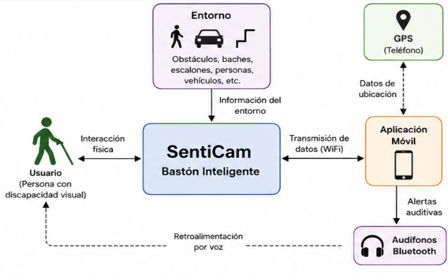
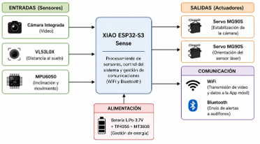
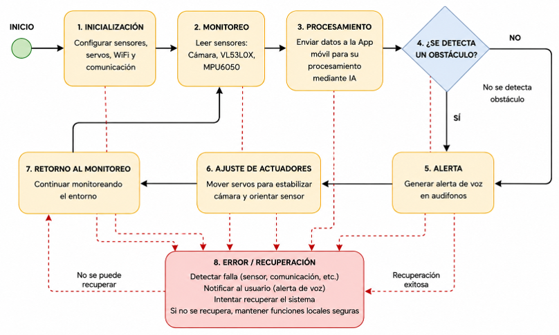
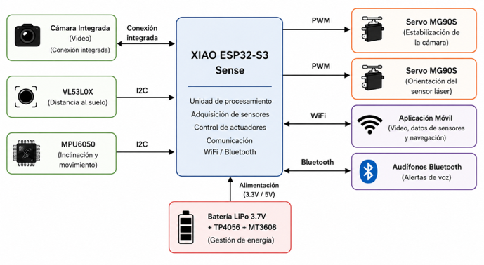

# SentiCam

## Bastón Inteligente Portátil de Asistencia para Personas con Discapacidad Visual mediante Visión Artificial, Sensores Inteligentes y XIAO ESP32-S3 Sense

**Nombre:** Víctor Adrián Guijarro Landa  
**Materia:** Sistemas Embebidos  
**Paralelo:** 02

---

## 1. Introducción

SentiCam es un sistema embebido diseñado para complementar el uso del bastón blanco tradicional mediante la incorporación de visión artificial, sensores inteligentes y comunicación inalámbrica. Su objetivo es mejorar la seguridad y autonomía de las personas con discapacidad visual durante su desplazamiento, permitiendo detectar obstáculos, desniveles y objetos elevados que un bastón convencional no siempre puede identificar.

La arquitectura propuesta utiliza una placa XIAO ESP32-S3 Sense como unidad principal de procesamiento, aprovechando su cámara integrada, conectividad WiFi y Bluetooth, además de su tamaño reducido y bajo consumo energético. El sistema incorpora un sensor láser VL53L0X para medir la distancia al suelo, un sensor MPU6050 para detectar la inclinación y movimiento del bastón y dos servomotores MG90S para estabilizar la cámara y orientar el sensor.

El procesamiento de visión artificial y la navegación asistida se realizan mediante una aplicación móvil. La información capturada por el sistema es transmitida hacia el teléfono, donde se ejecutan las funciones de inteligencia artificial y se utiliza el GPS para obtener información de ubicación y navegación. Finalmente, las indicaciones son comunicadas al usuario mediante alertas auditivas a través de audífonos Bluetooth.

La distribución de las tareas entre el sistema embebido y el teléfono móvil permite disminuir la carga computacional sobre la XIAO ESP32-S3 Sense y mantener un diseño compacto y portátil.

## 2. Alcance y Limitaciones

### Alcance

El sistema SentiCam permitirá:

- Detectar obstáculos, desniveles y escalones mediante el sensor VL53L0X.
- Capturar imágenes o video mediante la cámara integrada de la XIAO ESP32-S3 Sense.
- Obtener información de inclinación y movimiento mediante el MPU6050.
- Ajustar la orientación de la cámara y del sensor mediante dos servomotores MG90S.
- Ejecutar algoritmos de visión artificial mediante una aplicación móvil.
- Proporcionar orientación mediante GPS y alertas auditivas.
- Establecer comunicación WiFi entre el sistema embebido y la aplicación móvil.
- Utilizar comunicación Bluetooth para transmitir las alertas auditivas hacia los audífonos del usuario.
- Complementar las funciones del bastón blanco tradicional sin reemplazarlo.

### Limitaciones

El sistema presenta las siguientes limitaciones:

- No reemplaza completamente el bastón blanco tradicional ni las técnicas de orientación y movilidad.
- La precisión de la visión artificial puede verse afectada por las condiciones de iluminación.
- La navegación GPS depende de la cobertura satelital disponible.
- La autonomía del sistema depende de la capacidad y estado de la batería.
- El procesamiento de inteligencia artificial se ejecuta principalmente en el teléfono móvil y no directamente en la placa embebida.
- La pérdida de conexión WiFi puede interrumpir temporalmente la transmisión de información hacia la aplicación móvil.
- El sistema debe ser considerado una herramienta complementaria de asistencia y no un dispositivo que garantice por sí solo la seguridad del usuario.

## 3. Diagrama de Contexto

*Figura 1. Diagrama de Contexto.*

**Descripción:** El diagrama de contexto representa la interacción entre SentiCam, el usuario y los elementos externos del sistema. El usuario utiliza físicamente el bastón mientras los sensores y la cámara obtienen información del entorno, incluyendo obstáculos, desniveles y objetos ubicados durante el recorrido.

SentiCam transmite mediante WiFi la información necesaria hacia la aplicación móvil, donde se realiza el procesamiento de visión artificial. Paralelamente, el GPS del teléfono proporciona los datos de ubicación utilizados para la navegación asistida. Una vez procesada la información, la aplicación genera alertas auditivas que son transmitidas mediante Bluetooth hacia los audífonos del usuario.

De esta manera, SentiCam funciona como intermediario entre el entorno físico y el usuario, proporcionando información complementaria al uso convencional del bastón.

## 4. Diagrama de Bloques del Diseño

*Figura 2. Diagrama de Bloques del Diseño.*

**Descripción:** El sistema se encuentra organizado en cuatro bloques principales: entradas, procesamiento, salidas y alimentación/comunicación.

**Bloque de entradas:** Está compuesto por la cámara integrada de la XIAO ESP32-S3 Sense, el sensor de distancia VL53L0X y el sensor MPU6050. La cámara obtiene información visual del entorno, el VL53L0X mide la distancia con respecto a la superficie y el MPU6050 proporciona información de inclinación y movimiento.

**Bloque de procesamiento:** La XIAO ESP32-S3 Sense constituye la unidad principal del sistema embebido. Se encarga de adquirir la información proveniente de los sensores, controlar los servomotores y administrar las comunicaciones WiFi y Bluetooth.

**Bloque de salidas:** Está formado por dos servomotores MG90S. Uno permite estabilizar la orientación de la cámara y el segundo permite modificar la orientación del sensor según la inclinación y posición del bastón.

**Bloque de comunicación:** La comunicación WiFi permite intercambiar información con la aplicación móvil, mientras que Bluetooth permite la transmisión de las alertas auditivas hacia los audífonos utilizados por el usuario.

**Bloque de alimentación:** Proporciona la energía necesaria para el funcionamiento del sistema mediante una batería portátil, permitiendo mantener el dispositivo independiente de una fuente de alimentación fija.

## 5. Diagrama de Software (Máquina de Estados)

*Figura 3. Máquina de estados.*

### Funcionamiento de la máquina de estado

El funcionamiento de SentiCam comienza en el estado de Inicialización, donde se configuran los sensores, los servomotores y las comunicaciones inalámbricas necesarias.

Posteriormente, el sistema pasa al estado de Monitoreo, donde se adquieren continuamente datos de la cámara, del sensor VL53L0X y del MPU6050.

La información obtenida pasa al estado de Procesamiento, donde se evalúan las mediciones de los sensores y se transmite la información requerida hacia la aplicación móvil para su procesamiento.

A continuación, el sistema determina si existe una condición que requiera advertencia. Si no se detecta un obstáculo o situación de riesgo, el sistema continúa monitoreando el entorno. Si se identifica una condición de riesgo, pasa al estado de Alerta, donde se genera una advertencia para el usuario.

Posteriormente, en el estado de Ajuste de actuadores, los servomotores corrigen la orientación de la cámara y del sensor de acuerdo con la inclinación registrada. Finalmente, el sistema retorna al estado de monitoreo y repite continuamente el ciclo.

### Manejo de errores

En caso de pérdida temporal de comunicación WiFi o de una lectura inválida de algún sensor, el sistema deberá mantener las funciones locales disponibles e intentar restablecer la comunicación. Una falla de comunicación no deberá provocar movimientos inesperados de los servomotores.

## 6. Diseño de Interfaces

*Figura 4. Diseño de interfaces.*

El diseño de interfaces define cómo intercambian información los diferentes componentes de SentiCam. La utilización de interfaces independientes permite mantener una arquitectura modular y facilita las pruebas individuales de cada componente.

| Interfaz | Componentes | Información transmitida |
|---|---|---|
| I2C | VL53L0X → XIAO ESP32-S3 Sense | Mediciones de distancia |
| I2C | MPU6050 → XIAO ESP32-S3 Sense | Aceleración e inclinación |
| PWM | XIAO → Servomotores MG90S | Señal de posición/ángulo |
| Bus de cámara | Cámara → XIAO ESP32-S3 Sense | Información de imagen |
| WiFi | XIAO ↔ Aplicación móvil | Información del sistema y datos para procesamiento |
| Bluetooth | Aplicación móvil → Audífonos | Alertas e indicaciones auditivas |

*Tabla 1. Interfaces de comunicación del sistema SentiCam.*

En caso de pérdida de una interfaz de sensores, el sistema deberá identificar la ausencia o lectura inválida del dispositivo y evitar tomar decisiones utilizando información incorrecta. Si se pierde la comunicación WiFi, se intentará restablecer la conexión con la aplicación móvil. La pérdida de Bluetooth impedirá recibir temporalmente las indicaciones auditivas, por lo que esta condición deberá ser informada al usuario cuando sea posible.

Esta arquitectura permite desacoplar el procesamiento intensivo de imágenes del hardware embebido, optimizando el uso de los recursos computacionales de la XIAO ESP32-S3 Sense.

## 7. Alternativas de Diseño

### Microcontrolador

**Alternativa 1: ESP32-CAM**

**Ventajas:** Bajo costo, cámara incorporada y conectividad WiFi.

**Desventajas:** Menor disponibilidad de GPIO al utilizar la cámara, mayores restricciones para conectar sensores y actuadores adicionales y mayor dificultad para mantener un diseño compacto con todos los periféricos.

**Alternativa seleccionada: XIAO ESP32-S3 Sense**

**Ventajas:** Cámara integrada, tamaño reducido, conectividad inalámbrica y mayor capacidad para desarrollar un sistema portátil.

**Decisión:** Se selecciona la XIAO ESP32-S3 Sense debido principalmente a su tamaño reducido y a la integración de cámara y conectividad en una plataforma adecuada para incorporarse físicamente al bastón.

### Sensor de distancia

**Alternativa 1: HC-SR04**

**Ventajas:** Bajo costo y facilidad de implementación.

**Desventajas:** Mayor tamaño físico y menor conveniencia para realizar mediciones dirigidas hacia el suelo en un dispositivo compacto.

**Alternativa seleccionada: VL53L0X**

Utiliza medición láser y presenta un tamaño reducido, permitiendo integrarlo con mayor facilidad al bastón para detectar cambios de distancia relacionados con desniveles y escalones.

### Procesamiento de visión artificial

**Alternativa 1: Raspberry Pi**

Permitiría ejecutar localmente algoritmos de mayor complejidad, pero incrementaría considerablemente el tamaño, consumo energético y costo del dispositivo.

**Alternativa seleccionada: Aplicación móvil**

Se aprovecha la capacidad computacional del teléfono que porta el usuario, disminuyendo la carga de procesamiento y consumo energético del sistema instalado en el bastón.

### Sistema de alertas

**Alternativa 1: Vibración**

Permite generar alertas directamente en el bastón sin depender de audio.

**Alternativa seleccionada: Alertas auditivas mediante Bluetooth**

Permite proporcionar al usuario información más descriptiva sobre obstáculos y navegación mediante indicaciones de voz.

La XIAO ESP32-S3 Sense fue seleccionada debido a su cámara integrada, mayor capacidad de procesamiento, conectividad inalámbrica y tamaño reducido. El sensor VL53L0X ofrece mayor precisión para detectar desniveles respecto a sensores ultrasónicos, mientras que trasladar la inteligencia artificial hacia el teléfono móvil reduce significativamente la carga computacional del sistema embebido y facilita futuras actualizaciones del software.

## 8. Plan de Test y Validación

Antes de las pruebas de integración se verificará cada módulo individualmente. Posteriormente se realizarán pruebas conjuntas para comprobar que la comunicación entre sensores, actuadores, sistema embebido y aplicación móvil sea estable.

| ID | Prueba | Procedimiento | Resultado esperado | Criterio de aprobación |
|---|---|---|---|---|
| T01 | VL53L0X | Colocar superficies a diferentes distancias y comparar la lectura obtenida | El sensor registra cambios de distancia | Las mediciones son estables y permiten diferenciar superficie normal y desnivel |
| T02 | MPU6050 | Inclinar el bastón en diferentes ángulos | Detecta cambios de inclinación | Los valores cambian de forma coherente con el movimiento realizado |
| T03 | Servo de cámara | Modificar la inclinación del bastón | El servo compensa el movimiento | La cámara mantiene la orientación estable dentro del rango establecido |
| T04 | Servo del sensor | Cambiar el ángulo del bastón | El sensor modifica su orientación | Mantiene una orientación adecuada hacia la superficie |
| T05 | WiFi | Conectar SentiCam con la aplicación y transmitir información | Comunicación estable | La aplicación recibe los datos sin desconexiones críticas |
| T06 | Bluetooth | Generar una alerta desde la aplicación | El mensaje llega a los audífonos | El usuario recibe correctamente la alerta |
| T07 | Visión artificial | Presentar diferentes obstáculos frente a la cámara | La aplicación identifica los objetos establecidos | Se reconoce correctamente el obstáculo en las condiciones de prueba |
| T08 | GPS | Realizar una prueba en un recorrido conocido | La aplicación obtiene ubicación y ruta | La ubicación obtenida permite orientar correctamente al usuario |
| T09 | Pérdida de WiFi | Interrumpir temporalmente la conexión | El sistema detecta la pérdida e intenta reconectarse | El dispositivo no queda bloqueado y recupera la comunicación |
| T10 | Sistema integrado | Realizar un recorrido controlado utilizando el prototipo completo | Sensores, actuadores y aplicación funcionan conjuntamente | El sistema completa el recorrido sin errores críticos |

*Tabla 2. Pruebas que permitirán validar el funcionamiento del sistema.*

## 9. Consideraciones Éticas

El desarrollo de tecnologías de asistencia implica responsabilidades relacionadas con la seguridad, privacidad y confiabilidad. Una detección incorrecta podría producir falsas alertas o generar una confianza excesiva del usuario en el sistema. Por esta razón, SentiCam se plantea como una herramienta complementaria y no como un reemplazo del bastón blanco tradicional.

Debido al uso de una cámara integrada, también deben considerarse aspectos relacionados con la privacidad de las personas presentes en el entorno. Las imágenes capturadas deberán utilizarse únicamente con fines de asistencia y procesamiento, evitando su almacenamiento o utilización innecesaria.

Asimismo, el sistema deberá procurar que una falla electrónica o de comunicación no genere una condición más peligrosa para el usuario. Las funciones de asistencia deberán diseñarse bajo un criterio preventivo, informando cuando una funcionalidad importante no se encuentre disponible.

Finalmente, se busca desarrollar una solución económicamente accesible, portátil y escalable, favoreciendo que este tipo de tecnología pueda ser utilizada en el futuro por instituciones y personas relacionadas con la inclusión de personas con discapacidad visual.

## 10. Conclusiones

- El diseño de SentiCam establece una arquitectura modular que integra sensores, actuadores, comunicación inalámbrica y procesamiento mediante una aplicación móvil, permitiendo complementar las funciones del bastón blanco tradicional sin sustituirlo.
- La selección de la XIAO ESP32-S3 Sense, el VL53L0X y el MPU6050 responde a las necesidades de portabilidad, adquisición de información del entorno y control de orientación requeridas por el prototipo, mientras que el procesamiento de visión artificial en el teléfono reduce la carga computacional del sistema embebido.
- El plan de validación propuesto permitirá evaluar individualmente los componentes y posteriormente comprobar el comportamiento del sistema integrado, considerando además condiciones de falla de comunicación que podrían afectar el funcionamiento del dispositivo.
